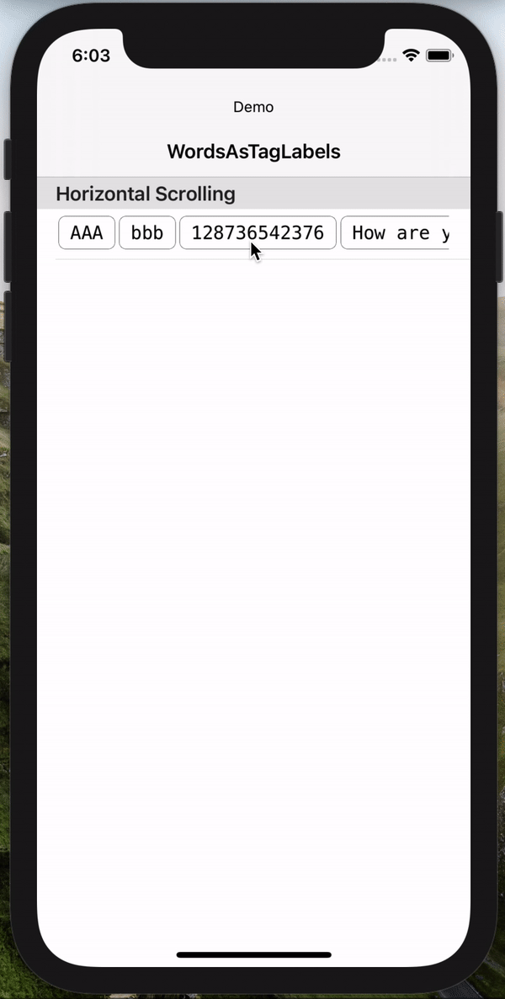

# Words As TagLabels - Custom Solution
[![Swift Version][swift-image]][swift-url]

This small iOS app is a solution for the case: **Creating Tag-Labels** for a String array & **Horizontally Scrolling** through them in a TableViewCell.

### The Solution Logic

1. Converting Strings to Labels
2. Customizing Labels
3. Converting Labels to Images
4. Converting Images to Attributed text
5. Creating TextView
6. Setting Attributed text to TextView
7. Adding TextView as a subview to ScollView
8. Adding ScrollView as a subview to TableViewCell

## Meta

Włodzimierz Woźniak

[w.wozniak@vivatum.com](mailto:w.wozniak@vivatum.com)

[vivatum.com](http://vivatum.com)

[swift-image]:https://img.shields.io/badge/swift-5.0-orange.svg
[swift-url]: https://swift.org/
